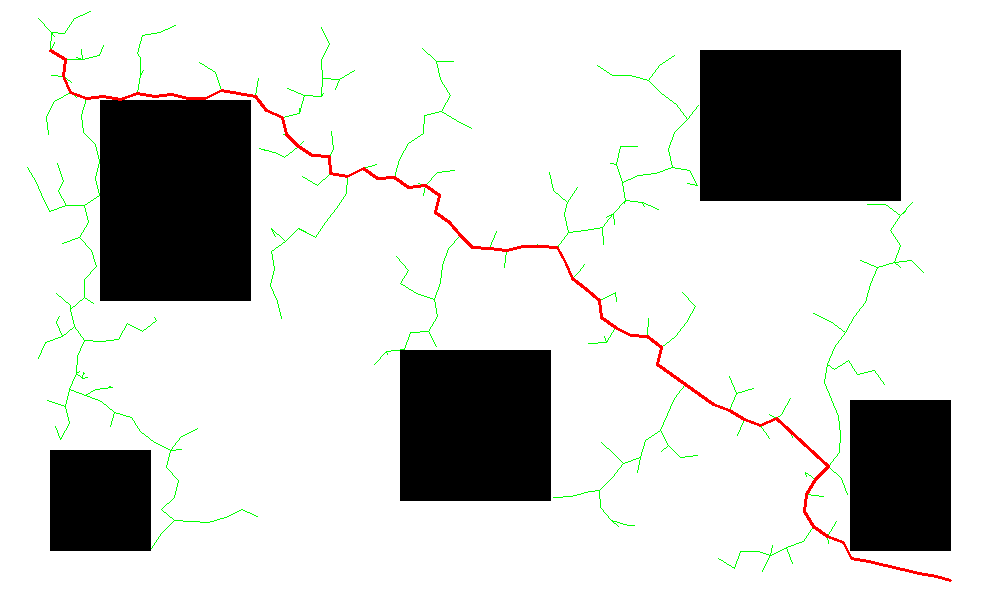
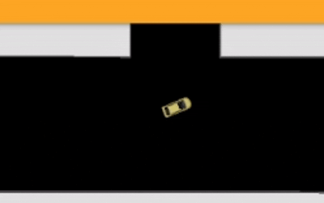

<p align="center">
  
</p>

<h1 align="center">
🤖 Planejamento de Caminho com RRT
</h1>

<p align="center">
Implementação do algoritmo <b>Rapidly-exploring Random Tree (RRT)</b> para planejamento de caminho em robótica móvel utilizando <b>Python</b>, <b>ROS 2</b> e <b>RoboticsAcademy (JdeRobot)</b>.
</p>

<p align="center">


[](https://github.com/marianadj901/rrt-global-navigation/releases/latest)

</p>

---

# 📖 Sobre o projeto

Este projeto foi desenvolvido para a disciplina de **Robótica Móvel** e consiste na implementação do algoritmo **Rapidly-exploring Random Tree (RRT)** para planejamento de caminho em ambientes com obstáculos.

O algoritmo recebe um mapa de ocupação, uma posição inicial (**Start**) e uma posição objetivo (**Goal**) e constrói uma árvore de exploração até encontrar uma rota livre de colisões.

Após encontrar o caminho, o robô percorre os waypoints utilizando um controlador proporcional simples.

---

# 📑 Sumário

- Sobre o algoritmo
- Objetivos
- Funcionamento
- Estrutura do projeto
- Navegação
- Tecnologias
- Estruturas implementadas
- Limitações
- Demonstração
- Resultado Obtido
- Autora

---

# 🌳 Sobre o algoritmo

O **Rapidly-exploring Random Tree (RRT)** é um algoritmo de planejamento baseado em amostragem muito utilizado em:

- 🤖 Robôs móveis
- 🚗 Veículos autônomos
- 🚁 Drones
- 🦾 Braços robóticos
- 🚀 Sistemas de navegação

Ao contrário do algoritmo **A\***, o RRT não necessita de um grafo previamente construído.

Ele explora o ambiente de forma incremental, criando uma árvore até encontrar uma rota viável.

---

# 🎯 Objetivos

O projeto implementa uma versão didática do algoritmo RRT capaz de:

- ✔ Gerar pontos aleatórios no mapa;
- ✔ Utilizar Goal Biasing;
- ✔ Encontrar o nó mais próximo;
- ✔ Expandir a árvore utilizando a função **Steer**;
- ✔ Detectar colisões;
- ✔ Reconstruir o caminho encontrado;
- ✔ Simular a navegação do robô.

---

# ⚙️ Funcionamento

O algoritmo segue as seguintes etapas:

```text
Mapa de Ocupação
        │
        ▼
Inicialização da árvore
        │
        ▼
Geração de ponto aleatório
(sample_random_point)
        │
        ▼
Busca do nó mais próximo
(find_nearest_node)
        │
        ▼
Expansão da árvore
(steer)
        │
        ▼
Verificação de colisão
(is_collision_free)
        │
        ▼
Adicionar novo nó
        │
        ▼
Objetivo alcançado?
        │
    Não │ Sim
        ▼
Reconstrução do caminho
        │
        ▼
Navegação do robô
```

---

# 📂 Estrutura do projeto

```text
rrt-global-navigation/

├── academy.py
├── mapa_com_arvore.png
├── gif.gif
├── relatorio.pdf
└── README.md
```

---

# 🚗 Navegação

Após o planejamento, o robô percorre o caminho encontrado.

Para cada waypoint são calculados:

- direção desejada;
- erro angular;
- velocidade angular;
- velocidade linear constante.

O processo continua até que todos os waypoints sejam alcançados.

---

# 💻 Tecnologias utilizadas

- Python 3
- NumPy
- OpenCV
- RoboticsAcademy
- ROS 2 Humble
- JdeRobot

---

# 🧠 Estruturas implementadas

O projeto implementa as seguintes funções principais:

- `sample_random_point()`
- `find_nearest_node()`
- `steer()`
- `is_collision_free()`
- `reconstruct_path()`
- `plan()`

---

# 📌 Limitações

Esta implementação corresponde a uma versão didática do algoritmo.

Foram adotadas algumas simplificações:

- robô tratado como um ponto;
- planejamento apenas em (x,y);
- movimento holonômico;
- ausência de dilatação de obstáculos;
- controlador proporcional simplificado.

Essas simplificações tornam o algoritmo mais adequado para fins educacionais.

---

# 📹 Demonstração

A animação abaixo mostra a execução completa do algoritmo, incluindo a navegação do robô até o objetivo.

<p align="center">
  
</p>

Durante a execução é possível observar:

- 🌳 Crescimento da árvore RRT;
- 🔴 Caminho final encontrado;
- 🚗 Navegação do robô seguindo a trajetória planejada.

---

<p align="center">
  <a href="https://github.com/marianadj901/rrt-global-navigation/releases/latest">
    ▶️ Assistir ao vídeo completo da execução
  </a>
</p>

---

# 📊 Resultado Obtido

| Métrica | Valor |
|---------|------:|
| Algoritmo | RRT |
| Linguagem | Python |
| Ambiente | RoboticsAcademy |
| Área livre | 491045 pixels |
| Obstáculos | 108955 pixels |
| Nós do caminho | 73 |
| Resultado | ✅ Caminho encontrado |

### Principais resultados

- ✔ Árvore RRT construída com sucesso;
- ✔ Caminho livre de colisões encontrado;
- ✔ Reconstrução automática da trajetória;
- ✔ Navegação completa até o objetivo;
- ✔ Visualização da árvore e do caminho final.

---

# 👩‍💻 Autora

**Mariana Lins**

Projeto desenvolvido para a disciplina de **Robótica Móvel**.

**Universidade Federal de Alagoas (UFAL)**

---

# 📌 Observação

Este projeto foi desenvolvido para fins acadêmicos como parte da disciplina de Robótica Móvel do programa Novo Ensino Suplementar (NES), da Universidade Federal de Alagoas (UFAL).
